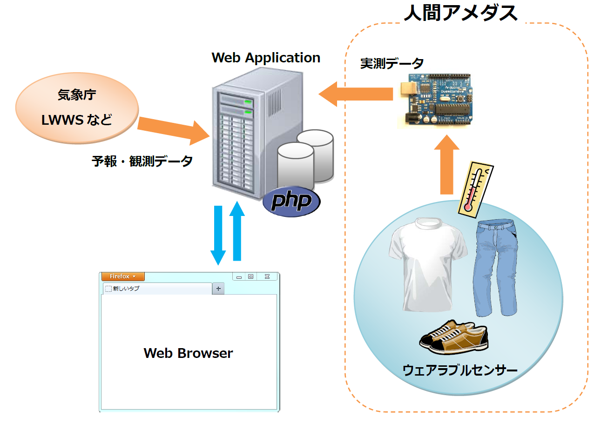

Wearable Web
=============

## 背景
その日に何を着ればよいのか判断するのは難しい。

## 問題提起
その日の気候に合った服装を自動的に提案してくれる仕組みがあれば、毎朝自分で服装を考える手間が省ける。

## 先行事例
### 今日の重ね着
[http://higashi-dance-network.appspot.com/kasanegi/](http://higashi-dance-network.appspot.com/kasanegi/)

- 東ダンスネットワーク
- 日本気象協会・アップフロンティア賞 受賞
- その日の気候に合った服装をアバター風に表示する

### ウェザーウェアー
[http://weatherwear.jp/](http://weatherwear.jp/)

- 株式会社カタボー
- iPhone用アプリ
- その日の気候に合ったコーディネートを提案する
- 有名ブランドと提携しており、表示されるコーディネートはファッション性が高い
- 表示されたアイテムを購入することもできる

### Wevther
[http://wevther.com/](http://wevther.com/)

- アメリカ国内のみ
- 「SVPPLY」と提携しファッションアイテムを購入可能。

## 提案
あとでもっとよく考えてまとめときます・・・
### 天気予報 ＋ 人間アメダス

- 温度・湿度のセンサーを複数取り付けた洋服を用意する。
  - 外気温、服の内側の温度、体温を測定
- 服の内側の温度・湿度（衣服/被服気候）が快適な状況かどうか判定する。
- サーモグラフィのような温度分布を表示する。
	- 自分の温度分布の特性（冷え性など）を知る。蒸れ具合の特性を知る。
		- 必要なら改善策を提案
- 衣服内の温度・湿度の推移をグラフ化する。
	- 外気温や運動強度との相関を調べ、快適な衣服内気候を保てる服装を提案する
	

### 疑問
- センサー付衣服を着るのならそれ以外の服を選択できない？
- 洗濯はできるのか？

## デモ

## 展望

