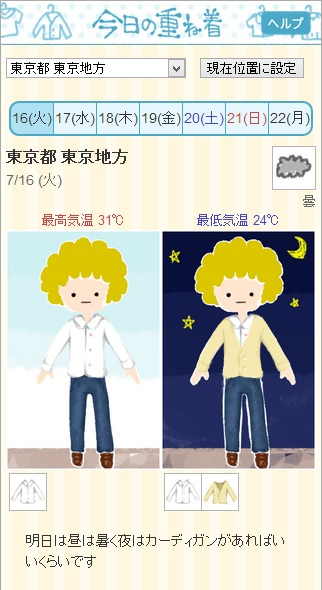

Wearable Web
=============

## 背景
その日に何を着ればよいのか判断するのは難しい。

## 問題提起
その日の気候に合った服装を自動的に提案してくれる仕組みがあれば、毎朝自分で服装を考える手間が省ける。

## 先行事例
### 今日の重ね着
[http://higashi-dance-network.appspot.com/kasanegi/](http://higashi-dance-network.appspot.com/kasanegi/)

=======

- 東ダンスネットワーク
- 日本気象協会・アップフロンティア賞 受賞
- 天気予報をもとに、その日の気候に合った服装をアバター風に表示する
- Twitter とも連携

### ウェザーウェアー
[http://weatherwear.jp/](http://weatherwear.jp/)

- 株式会社カタボー
- iPhone用アプリ
- 天気予報をもとに、その日の気候に合ったコーディネートを提案する
- 有名ブランドと提携しており、表示されるコーディネートはファッション性が高い
- 表示されたアイテムを購入することもできる

## 提案

### 方針
- Webサイトから服装提案サービスを提供する。
- 気温だけではなく、湿度や風速を含めた「体感温度」をもとに考えることで、より快適な服装を提案できる。
- さらに服の内側に各種センサーを取り付け、そこから得られた「衣服気候」を統計処理することで、さらに提案の正確性を高める。
- また、温度の感じ方も人それぞれであることから、できるだけ一人一人に最適化された服装を提案する。

### 概要

- 各種センサーを組み込んだ装置を洋服に取り付ける。
	- 外気温、衣服気候を測定し、データを蓄積する
- 天気予報をもとにして、なるべく理想的な衣服気候になるような服装を提案する。
	- サービスはWebサイトから提供
	- 個人個人に最適化された服装提案を行う
		- 地域ごとの特性、個人の特性（暑がりなど）も考慮する
		- 提案した服装を着たときのセンサー情報を集め、本当に快適な衣服気候になっているか判断。提案の精度を上げていく
- 衣服内の温度・湿度の推移をグラフ化する。
	- 外気温や運動強度（加速度センサーを利用すれば）との相関もわかる  
→ どう利用するか難しい
- 衣服内の温度分布・湿度分布を視覚的に表示する。
	- 温度が高くなりやすい部位、蒸れやすい部位を知る
		- 服装の提案に反映する。必要であれば、その他の改善策も提案する

### キーワード
- 衣服気候（被服気候）  
→ 肌と服の間の環境。温度32℃、湿度50％、気流25cm/s が最も快適らしい。
- 体感温度  
→ 以下の6つの要素により決まる。
	- 環境要素：気温、温度、気流、放射
	- 人的要素：着衣量、活動量  
	→ 着衣量(clo値)： 衣服の保温性の高さを示す。熱の逃げにくい素材であるか、重ね着するほど大きくなる  
- 不快指数  
→ 温度と湿度から簡易的に計算される体感温度の指標。より実感に近づけるには気流など他の要素も考慮する必要がある。

### 予想される質問など、その他メモ
- 外付けのセンサーをいちいち取り付けるのはめんどくさいのでは？
- 衣服気候を測定する先行事例をもっと調べたほうがよさそう
- 小さいファンを載せて蒸し暑いときに回す
- ランキング、他の人との比較

## デモ
下図を参考に

## 展望

