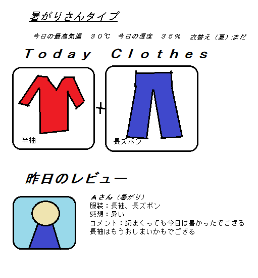

ウェアラブルウェブ
================

##背景
- その日に何を着ればよいのか判断するのは難しい。

##問題設定
- 季節の変わり目など服装の判断が難しい。
- 外に出るまで周りの人の服装はわからない。

##解決策
- 気象条件やユーザーから収集したデータから適切な服装を提案する。

#デバイス（7/7 更新）
- 衣類にセンサー(温度・湿度)をいくつか取り付ける。
	- 外気温、服の内側の温度、体温を測定。
- サーモグラフィのような温度分布をリアルタイムで表示。  
 （簡易的には、LEDの色で温度を示す）
	- 自分の温度分布の特性（冷え性など）を知る。蒸れ具合の特性を知る。
		- 必要なら改善策を提案
	- 表示デバイスはリストバンド型だと便利そう。  
	- 熱中症の警告。水虫注意。
- 衣服内の温湿度の推移をグラフ化。
	- 外気温や運動強度との相関はどうか
	- 温湿度が特に高くなりやすい部位はあるか
	- これらの実測をもとに、快適な衣服内気候を保てる服装を提案する。
		- オーダーメイドもいい
		- ファンを載せて、蒸れたら回すとか
- ランキングとか作れそう。
	- もろもろのデータを他の人と比較してみたい。
	- 空調の効いた部屋との最大気温差。蒸れ具合。etc

##具体案
サービスはWebサイトやスマートフォンアプリで提供する。
ハッシュタグを指定して、Twitterなどから投稿もできる。

- Yahoo!の気象条件API・Livedoor Weather Web Serviceなどからその日の気象条件を取得
	- これらに基づき、快適に過ごせる服装を提案
- 衣類センサーから実測データを収集。
- 国内に限らず、海外も。
- 地域ごとの特性、個人の性格（暑がり・寒がり・冷え症）などもパラメータになる。
- ユーザーからの情報を収集 (例: 「今日は半袖では寒かった」「夕方は上着は必要」など)

