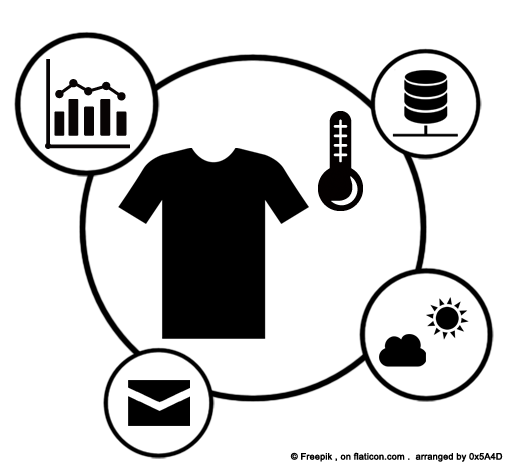

個人気象庁
================
Wearable Web

- ウェアラブルセンサーを利用した人間アメダスと個人気象庁的な構想
- 衣服コーディネータ

## 概要
衣服・靴などにセンサーを取り付けた、ウェアラブルセンサーデバイスを製作。  
その測定データや気象情報から快適な服装に近づく服装を提案するというもの。

しかし、服装をコーディネートするサービスは[先行事例](https://github.com/chuo-u-openproject2013/WearableWeb/wiki/Wearable-Web#%E5%85%88%E8%A1%8C%E4%BA%8B%E4%BE%8B)が多く存在する。  
したがって、ウェアラブルセンサーを「人間アメダス」と位置づけ、実測データの更なる活用を模索する。  
個人の環境における気象庁、いわば「個人気象庁」のようなものを提供できると面白い。

--------------

詳細はWikiを=>> <https://github.com/chuo-u-openproject2013/WearableWeb/wiki>
